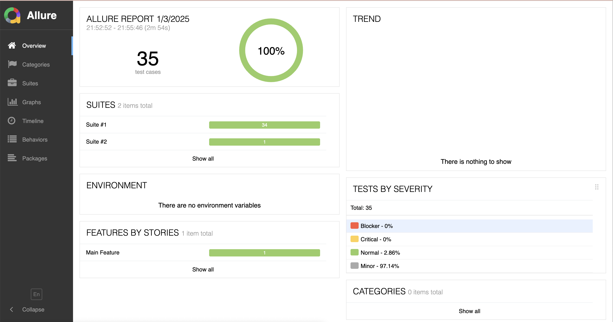

# Severity Plugin for Allure Report

This plugin is designed to display the number of tests by their priority in the form of a table.

> :rotating_light: The data is collected based on the Allure annotation **@Severity**.  
> For proper functionality, all tests must be annotated with this annotation.

## :rocket: How it works
Plugin collects the data after test run has finished. It iterates over each test from test suite and collect
information based on allure-annotation 'Severity'. Information is saved into the file named 'severity-table.json'.
This file is parsed by plugin and its data is displayed in the tab 'Overview' > widget 'Tests by severity'.



This plugin works as designed in [Allure Documentation](https://github.com/allure-framework/allure-docs/blob/main/content/plugins/overview.md])  
To enable this plugin it's needed to copy compiled classes into the folder 'plugins' of allure-commandline.  
```xml
   <argument>
       ./mvnw -f pom.xml package <!--create jar file with compiled plugin classes-->
       mkdir ../${allure.commandline}/plugins/severity-plugin <!--create directory for severity-plugin in allure plugins folder-->
       cp target/severity-plugin-1.0-SNAPSHOT.jar ../${allure.commandline}/plugins/severity-plugin <!--copy .jar file-->
       cp -r src/dist/static ../${allure.commandline}/plugins/severity-plugin <!--copy the folder './static' with .js ans .css files-->
       cp src/allure-plugin.yml ../${allure.commandline}/plugins/severity-plugin <!--copy a configuration file allure-plugin.yml-->
       echo "  - severity-plugin" >> ../${allure.commandline}/config/allure.yml <!--write 'severity-plugin' into profile configuration file-->
   </argument>
```

## :bulb: How to enable plugin
1. Add project with plugin into your test project
2. In ./severity-plugin/pom.xml set path to the folder where allure-commandline is downloaded, e.g:
```xml
<allure.commandline>target/allure/allure-${allure.version}</allure.commandline>
```
3. Update test pipeline
```
mvn -f <path_to_test_pom.xml> allure:install
mvn -f <path_to_severity_plugin_pom.xml> compiler:compile exec:exec@severity-plugin
mvn -f <path_to_test_pom.xml> allure:report
```